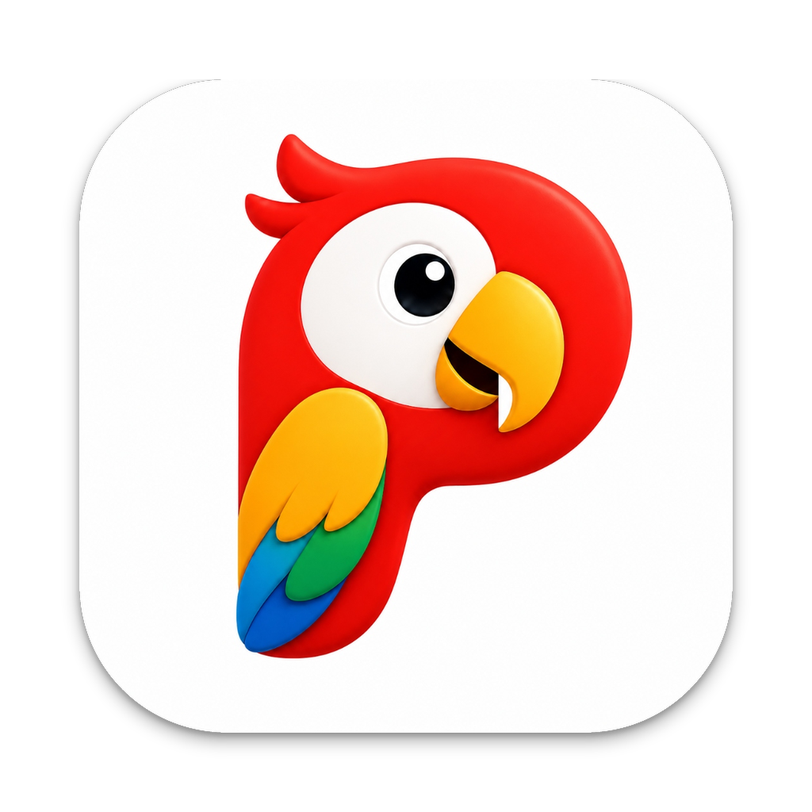
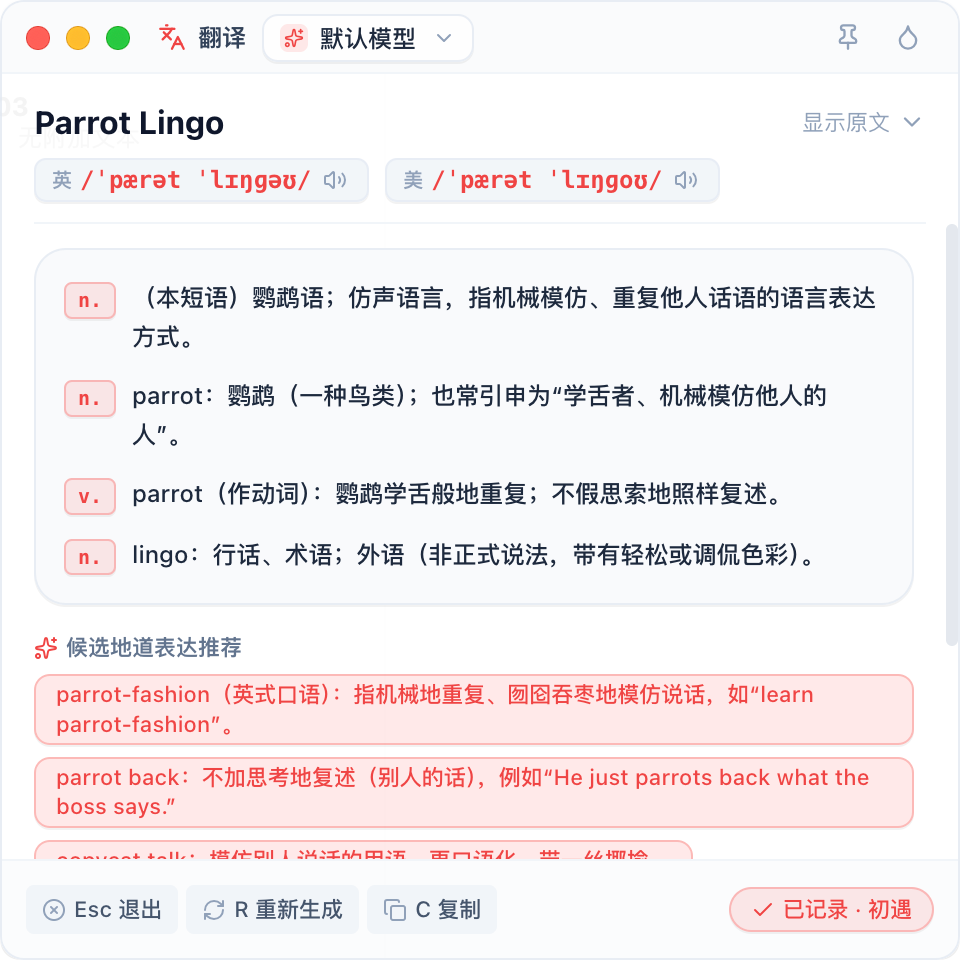
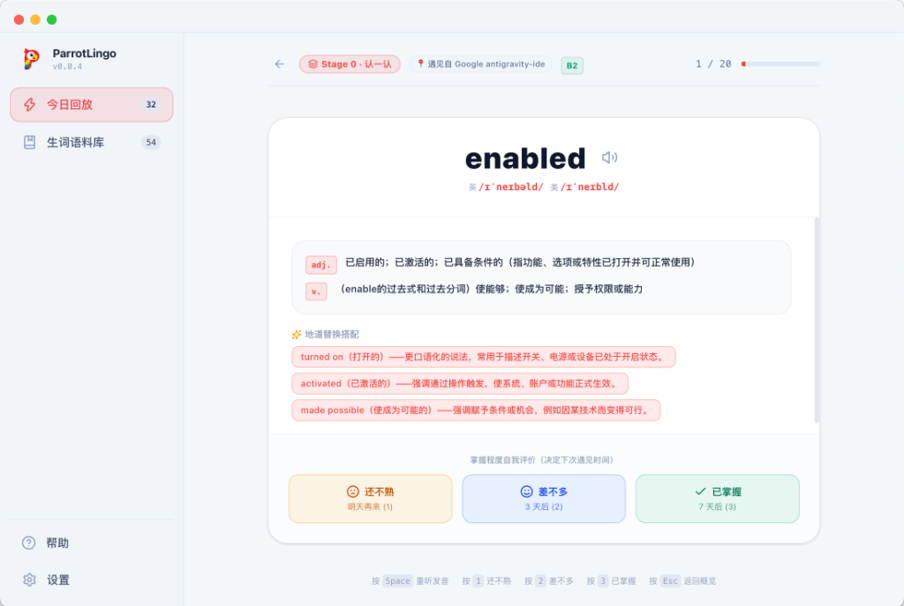

<div align="center">

  

# ParrotLingo

  <p align="center">
    <strong>AI-Powered Next-Gen Desktop Assistant for Immersive Language Learning & Instant Selection Translation</strong><br />
    <em>Local-first • Privacy-centric • BYOK • Multi-model AI Integration</em>
  </p>

  <p align="center">
    <a href="README.md"><strong>English</strong></a> •
    <a href="README_zh.md"><strong>简体中文</strong></a>
  </p>

  <p align="center">
    <a href="https://github.com/zzice/parrot-lingo/releases/latest">
      
    </a>
    <a href="https://github.com/zzice/parrot-lingo/blob/main/LICENSE">
      
    </a>
    
    
    
    
    
  </p>

  <p align="center">
    <a href="#-why-parrotlingo">Why ParrotLingo</a> •
    <a href="#-key-features">Key Features</a> •
    <a href="#-supported-platforms">Supported Platforms</a> •
    <a href="#-tech-stack">Tech Stack</a> •
    <a href="#-quick-start">Quick Start</a> •
    <a href="#-installation--download">Installation</a> •
    <a href="#-acknowledgements">Acknowledgements</a> •
    <a href="#-license">License</a>
  </p>

  <p align="center">
    
  </p>

</div>

---

## 💡 Why ParrotLingo?

When browsing the web, reading papers, or writing code, switching between translation apps constantly interrupts your flow, and looked-up words are easily forgotten.

**ParrotLingo** is crafted for professionals and lifelong learners who value peak efficiency and systematic language mastery:

- **Instant Global Selection**: Highlight any text on your screen to translate with near-zero latency, accompanied by deep contextual explanations (phonetics, grammar nuances, collocations, native alternatives).
- **Local-First & Private**: All vocabulary, corpus items, and review records stay on your local device via embedded SQLite.
- **BYOK (Bring Your Own Key)**: Directly connect to your preferred AI models with zero intermediate server relays.
- **Continuous Learning Loop**: Automatically transforms lookups into custom corpus entries and daily spaced repetition review cards.

---

## 💻 Supported Platforms

ParrotLingo provides full native support for modern desktop platforms:

| Platform            | Architecture                              | Distribution Formats    | Status             |
| :------------------ | :---------------------------------------- | :---------------------- | :----------------- |
| **macOS** (11.0+)   | Apple Silicon (M1/M2/M3/M4) & Intel (x64) | `.dmg` • `.zip`         | ✅ Fully Supported |
| **Windows** (10/11) | x64 & ARM64                               | `.exe` (NSIS Installer) | ✅ Fully Supported |

---

## ✨ Key Features

```
  ┌───────────────────────┐       ┌──────────────────────┐       ┌──────────────────────┐
  │ Instant Text Capture  │ ───►  │ Multi-Model AI Intel │ ───►  │ Local-First Corpus   │
  │ (Hover Capsule / Hook)│       │ (BYOK + Local LLMs)  │       │ (Ebbinghaus Spaced)  │
  └───────────────────────┘       └──────────────────────┘       └──────────────────────┘
```

### ⚡️ 1. Ultra-fast Floating Capsule & Action Window

- **System-wide Native Selection**: Powered by macOS Accessibility & global low-level hooks. Text selected anywhere pops up a responsive floating capsule.
- **Custom Shortcut Triggers**: Quick translation via double-click `Cmd/Ctrl` or custom keybindings.
- **Floating Action Window**: Pinned mode (`Pin`), stepless opacity adjustment (`20% - 100%`), and native frosted glass blur effect.

<p align="center">
  
</p>

### 🧠 2. BYOK & Flexible AI Model Ecosystem

- **Built-in Presets**: Pre-configured with **ParrotLingo AI**, **DeepSeek**, **Zhipu AI (GLM-4)**, etc.
- **Bring Your Own Key (BYOK)**: API keys are securely stored locally, calling model providers directly with zero telemetry.
- **Custom Models & Local LLMs**: Full compatibility with **OpenAI-compatible APIs**, allowing you to plug in any custom provider or local offline LLMs via **Ollama** or **LM Studio**.
- **Deep Semantic Analysis**: Goes beyond literal translation to break down nuances, parts of speech, and authentic native collocations.

### 📚 3. Personal Corpus & "Today's Replay" Spaced Review

- **One-Click Collect**: Save words, phrases, and entire context sentences into your personal vocabulary repository.
- **Ebbinghaus Spaced Repetition**: Intelligently schedules daily review queues based on recall confidence (Remembered / Fuzzy / Forgotten).
- **Embedded SQLite Storage**: Robust local database managing millions of items with instant full-text search, exportable as JSON.

<p align="center">
  
</p>

### 🎨 4. Premium Aesthetic & 5-Language Localization

- 🌓 **Adaptive Dark / Light Themes**: Seamlessly follows system appearance.
- 🎨 **Dynamic Accent Palette**: 7 curated designer themes (Emerald, Ocean Blue, Royal Purple, Rose Pink, Amber Orange, Teal Cyan, Slate) + custom HEX color input.
- 🌐 **Strict 5-Language i18n**: Fully localized in **English**, **简体中文**, **繁體中文**, **日本語**, and **한국어**.

---

## 🛠️ Tech Stack

ParrotLingo is built with a modern desktop stack designed for speed and reliability:

| Layer                  | Technology                                  | Details                                     |
| :--------------------- | :------------------------------------------ | :------------------------------------------ |
| **Desktop Runtime**    | `Electron 39` + `Node.js 22`                | Multi-window desktop container              |
| **Build Tooling**      | `electron-vite 5` + `Vite 7`                | Ultra-fast HMR and optimized builds         |
| **UI Framework**       | `React 19` + `TypeScript 5.9`               | Component-driven, strictly typed UI         |
| **Design & Styling**   | `Tailwind CSS v4` + `Radix UI` + `Lucide`   | Modern, responsive desktop UI tokens        |
| **State Management**   | `Zustand 5`                                 | IPC-synchronized cross-window state store   |
| **Local Database**     | `better-sqlite3 13`                         | High-concurrency embedded SQLite            |
| **Native Integration** | `macOS Accessibility APIs` / `uiohook-napi` | Global cursor positioning & selection hooks |

---

## 🚀 Quick Start

### Prerequisites

- **Node.js** >= 22.0.0
- **pnpm** >= 9.0.0

### 1. Clone & Install Dependencies

```bash
git clone https://github.com/zzice/parrot-lingo.git
cd parrot-lingo

pnpm install
```

### 2. Run in Development Mode

```bash
pnpm dev
```

### 3. Type Check & Formatting

```bash
# TypeScript verification (Node + Web)
pnpm typecheck

# Code format & lint
pnpm format
pnpm lint
```

---

## 📦 Packaging & Build

Build platform-specific release installers:

```bash
# macOS (Generates .dmg & .zip for Apple Silicon and Intel)
pnpm build:mac:all

# Windows (Generates .exe NSIS installer)
pnpm build:win

# Universal production build
pnpm build
```

---

## 🔄 Auto-Update Flow

ParrotLingo features automated multi-platform release CI/CD:

1. Update version in `package.json` and push a git tag (e.g. `git tag v0.0.1 && git push origin --tags`).
2. GitHub Actions automatically compiles macOS and Windows release binaries.
3. Built-in `electron-updater` delivers in-app update notifications and seamless installation.

---

## 🤝 Contributing

Contributions, issues, and feature suggestions are warmly welcomed!

1. Fork the repository (`git checkout -b feature/AmazingFeature`)
2. Commit your changes (`git commit -m 'feat: add some amazing feature'`)
3. Push to your branch (`git push origin feature/AmazingFeature`)
4. Open a Pull Request

---

## 🙏 Acknowledgements

ParrotLingo is built upon and inspired by the remarkable open-source community:

- **[selection-hook](https://github.com/0xfullex/selection-hook)** — A lightweight, cross-platform library for global text selection listening and screen coordinate positioning.
- **[Cherry Studio](https://github.com/CherryHQ/cherry-studio)** — A world-class desktop client for multi-model AI workflows. Huge gratitude for their exceptional UX concepts and community contributions.
- **[Electron Vite](https://electron-vite.org)** — Next-generation Electron development tooling.
- **[Radix UI](https://www.radix-ui.com/)** & **[Tailwind CSS](https://tailwindcss.com/)** — Unstyled, accessible UI components and modern styling system.

---

## 📄 License

Distributed under the [MIT License](LICENSE). Feel free to use, modify, and build upon this project.

<div align="center">
  <br />
  <sub>Crafted with ❤️ for language learners and knowledge seekers around the globe.</sub>
</div>
